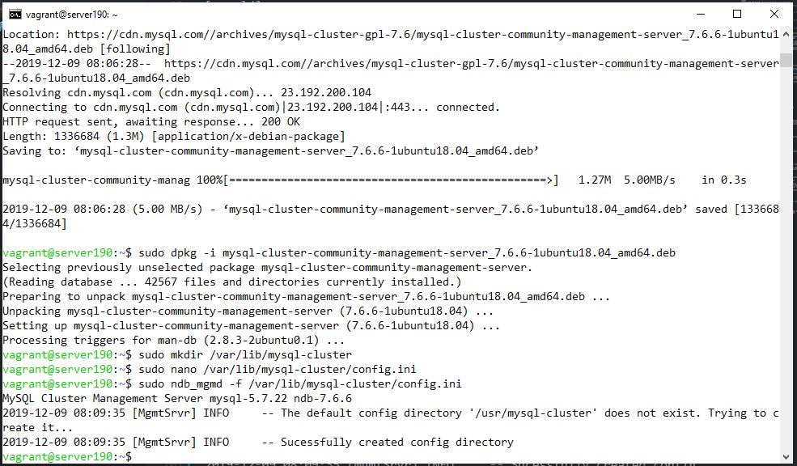
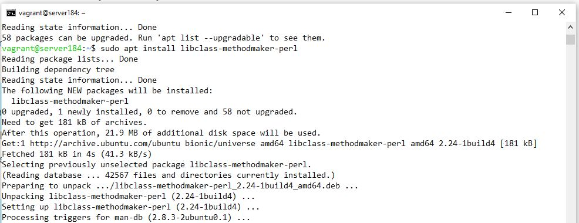

## Deskripsi Singkat
### 1. Layered Architecture Design
### 2. Basis Data Terdistribusi MySQL Cluster
Basis data terdistribusi MySQL Cluster menyediakan ketersediaan dan throughput tinggi untuk sistem manajemen basis data MySQL. MySQL Cluster terdiri dari satu atau lebih node manajemen (`ndb_mgmd`) yang menyimpan konfigurasi cluster dan mengontrol data node (`ndbd`), tempat data cluster disimpan. Setelah berkomunikasi dengan node manajemen, klien (klien MySQL, server, atau API asli) terhubung langsung ke node data ini.
Dengan MySQL Cluster biasanya tidak ada replikasi data, tetapi sinkronisasi data node. Untuk tujuan ini, mesin data khusus harus digunakan - NDBCluster (NDB). Sangat membantu untuk menganggap cluster sebagai lingkungan MySQL logis tunggal dengan komponen yang berlebihan. Dengan demikian, MySQL Cluster dapat berpartisipasi dalam replikasi dengan MySQL Clusters lainnya.
MySQL Cluster bekerja paling baik di lingkungan shared-nothing. Idealnya, tidak ada dua komponen yang berbagi perangkat keras yang sama. Untuk tujuan kesederhanaan dan demonstrasi, kami akan membatasi diri untuk hanya menggunakan tiga server. Kami akan menyiapkan dua server sebagai simpul data yang menyinkronkan data di antara mereka. Server ketiga akan digunakan untuk Cluster Manager dan juga untuk server MySQL / klien. Jika ingin memutar server tambahan,  dapat ditambahkan lebih banyak data node ke cluster, memisahkan manajer cluster dari server MySQL / klien, dan mengkonfigurasi lebih banyak server sebagai Manajer Cluster dan server MySQL / klien.

## Implementasi Arsitektur Sistem Basis Data Terdistribusi
### 1. Spesifikasi Sistem
Arsitektur terdiri dari 8 server, masing-masing server memiliki spesifikasi sebagai berikut:
- 512 MB RAM
- Ubuntu 18.04

Pembagian IP server sebagai berikut:
- NDB Management server:
  - `192.168.16.190`
- NDB Data server:
  - `192.168.16.184`
  - `192.168.16.185`
  - `192.168.16.186`
- MySQL Server:
  - `192.168.16.187`
  - `192.168.16.188`
  - `192.168.16.189`
- ProxySQL:
  - `192.168.16.191`
### 2. Gambaran Sistem
### 3. Proses Konfigurasi dan Instalasi

#### 3.1. Install Dan Mengkonfigurasi Cluster Manager

- Pertama-tama akan dimulai dengan mengunduh dan menginstal MySQL Cluster Manager, `ndb_mgmd`.
- Login pada server `192.168.16.190` dan download file `.deb` berikut:
```bash
wget https://dev.mysql.com/get/Downloads/MySQL-Cluster-7.6/mysql-cluster-community-management-server_7.6.6-1ubuntu18.04_amd64.deb
```
- Install `ndb_mgmd` menggunakan dpkg:
```bash
sudo dpkg -i mysql-cluster-community-management-server_7.6.6-1ubuntu18.04_amd64.deb
```
- Kita sekarang perlu mengkonfigurasi `ndb_mgmd` sebelum menjalankannya; konfigurasi yang tepat akan memastikan sinkronisasi dan memuat distribusi yang benar di antara node data.
- Cluster Manager harus menjadi komponen pertama yang diluncurkan di setiap cluster MySQL. Ini membutuhkan file konfigurasi, diteruskan sebagai argumen untuk dieksekusi. Kami akan membuat dan menggunakan file konfigurasi berikut: `/var/lib/mysql-cluster/config.ini`.
- Pada cluster manager, buat `/var/lib/mysql-cluster` yang akan diisi:
```bash
sudo mkdir /var/lib/mysql-cluster
```
- Selanjutnya buat dan ubah file konfigurasi:
```bash
sudo nano /var/lib/mysql-cluster/config.ini
```
- Kemudian tempelkan:
```bash
[ndbd default]
# Options affecting ndbd processes on all data nodes:
NoOfReplicas=3  # Number of replicas

[ndb_mgmd]
# Management process options:
hostname=192.168.16.190 # Hostname of the manager
datadir=/var/lib/mysql-cluster  # Directory for the log files

[ndbd]
hostname=192.168.16.184 # Hostname/IP of the first data node
NodeId=2            # Node ID for this data node
datadir=/usr/local/mysql/data   # Remote directory for the data files

[ndbd]
hostname=192.168.16.185 # Hostname/IP of the second data node
NodeId=3            # Node ID for this data node
datadir=/usr/local/mysql/data   # Remote directory for the data files

[ndbd]
hostname=192.168.16.186 # Hostname/IP of the second data node
NodeId=4            # Node ID for this data node
datadir=/usr/local/mysql/data   # Remote directory for the data files

[mysqld]
# SQL node options:
hostname=192.168.16.187 # In our case the MySQL server/client is on the same Droplet as the cluster manager

[mysqld]
# SQL node options:
hostname=192.168.16.188 # In our case the MySQL server/client is on the same Droplet as the cluster manager

[mysqld]
# SQL node options:
hostname=192.168.16.189 # In our case the MySQL server/client is on the same Droplet as the cluster manager
```
- Setelah menempel di teks ini, pastikan untuk mengganti nilai `hostname` di atas dengan alamat IP yang benar dari IP yang telah Anda konfigurasikan. Mengatur parameter `hostname` ini adalah ukuran keamanan penting yang mencegah server lain dari terhubung ke Cluster Manager.
- Simpan file dan tutup editor teks Anda.
- Ini adalah file konfigurasi minimal yang diperkecil untuk MySQL Cluster. Anda harus menyesuaikan parameter dalam file ini tergantung pada kebutuhan produksi Anda. Untuk sampel, file konfigurasi `ndb_mgmd` yang sepenuhnya dikonfigurasi, bacalah dokumentasi MySQL Cluster.
- Dalam file di atas Anda dapat menambahkan komponen tambahan seperti data node (`ndbd`) atau server MySQL (`mysqld`) dengan menambahkan instance ke bagian yang sesuai.
- Kita sekarang dapat memulai manajer dengan mengeksekusi binary `ndb_mgmd` dan menentukan file konfigunya menggunakan flag `-f`:
```bash
sudo ndb_mgmd -f /var/lib/mysql-cluster/config.ini
```
- Dan seharusnya akan mengeluarkan output berikut:

```bash
MySQL Cluster Management Server mysql-5.7.22 ndb-7.6.6
2019-12-09 08:09:35 [MgmtSrvr] INFO     -- The default config directory '/usr/mysql-cluster' does not exist. Trying to create it...
2019-12-09 08:09:35 [MgmtSrvr] INFO     -- Sucessfully created config directory
```
- Ini menunjukkan bahwa server MySQL Cluster Management telah berhasil diinstal.
- Idealnya, setiap ingin memulai server Manajemen Cluster secara otomatis saat boot. Untuk melakukan ini, kami akan membuat dan mengaktifkan layanan systemd.
- Sebelum kita membuat layanan, kita perlu mematikan server yang berjalan:
```bash
sudo pkill -f ndb_mgmd
```
- Lalu buka dan ubah systemd unit file 
```bash
sudo nano /etc/systemd/system/ndb_mgmd.service
```
- Tempelkan potongan kode berikut:
```bash
[Unit]
Description=MySQL NDB Cluster Management Server
After=network.target auditd.service

[Service]
Type=forking
ExecStart=/usr/sbin/ndb_mgmd -f /var/lib/mysql-cluster/config.ini
ExecReload=/bin/kill -HUP $MAINPID
KillMode=process
Restart=on-failure

[Install]
WantedBy=multi-user.target
```
- Di sini, kita telah menambahkan sekumpulan opsi yang menginstruksikan `systemd` tentang cara memulai, menghentikan, dan memulai kembali proses `ndb_mgmd`. Untuk mempelajari lebih lanjut tentang opsi yang digunakan dalam konfigurasi unit ini, bacalah manual `systemd`.
- Simpan dan tutup file.
- Sekarang, muat ulang konfigurasi manajer `systemd` menggunakan `daemon-reload`:
```bash
sudo systemctl daemon-reload
```
- Kita akan mengaktifkan layanan yang baru saja kami buat sehingga MySQL Cluster Manager dimulai saat reboot:
```bash
sudo systemctl enable ndb_mgmd
```
- Eksekusi service tersebut:
```bash
sudo systemctl start ndb_mgmd
```
- Anda dapat memverifikasi bahwa layanan NDB Cluster Management sedang berjalan:
```bash
sudo systemctl status ndb_mgmd
```
Jika berhasil akan mengeluarkan output sebagai berikut:

```bash
● ndb_mgmd.service - MySQL NDB Cluster Management Server
   Loaded: loaded (/etc/systemd/system/ndb_mgmd.service; enabled; vendor preset: enabled)
   Active: active (running) since Mon 2019-12-09 08:13:03 UTC; 8s ago
  Process: 13244 ExecStart=/usr/sbin/ndb_mgmd -f /var/lib/mysql-cluster/config.ini (code=exited, status=0/SUCCESS)
 Main PID: 13253 (ndb_mgmd)
    Tasks: 11 (limit: 504)
   CGroup: /system.slice/ndb_mgmd.service
           └─13253 /usr/sbin/ndb_mgmd -f /var/lib/mysql-cluster/config.ini

Dec 09 08:13:03 server190 systemd[1]: Starting MySQL NDB Cluster Management Server...
Dec 09 08:13:03 server190 ndb_mgmd[13244]: MySQL Cluster Management Server mysql-5.7.22 ndb-7.6.6
Dec 09 08:13:03 server190 systemd[1]: Started MySQL NDB Cluster Management Server.
```
- Yang menunjukkan bahwa server MySQL Cluster Management `ndb_mgmd` sekarang berjalan sebagai layanan `systemd`.
- Langkah terakhir untuk mengatur Cluster Manager adalah mengizinkan koneksi masuk dari node MySQL Cluster lainnya di jaringan pribadi kami.
- Jika Anda tidak mengonfigurasi ufw firewall saat mengatur server ini, Anda dapat langsung beralih ke bagian selanjutnya.
- Kami akan menambahkan aturan untuk memungkinkan koneksi masuk lokal dari kedua node data:
```bash
sudo ufw allow from 192.168.16.184
sudo ufw allow from 192.168.16.185
sudo ufw allow from 192.168.16.186
```
- Setelah menjalankan perintah tersebut, seharusnya akan terlihat output sebagai berikut:
```bash
#Output
Rule added
```
- Cluster Manager sekarang seharusnya sudah aktif dan berjalan, dan dapat berkomunikasi dengan node Cluster lainnya melalui jaringan pribadi.
#### 3.2. Instalasi dan Konfigurasi Data Nodes

**Note: Semua perintah disini harus dijalankan disemua data nodes.**

- Sekarang, masuk ke node pertama Anda (dalam tutorial ini, 192.168.16.184), dan unduh file deb ini:
```bash
wget https://dev.mysql.com/get/Downloads/MySQL-Cluster-7.6/mysql-cluster-community-data-node_7.6.6-1ubuntu18.04_amd64.deb
```

- Sebelum menginstall data node binary, kita perlu menginstall `libclass-methodmaker-perl`

```bash
sudo apt update
sudo apt install libclass-methodmaker-perl
```




- Lalu install data node binary menggunakan `dpkg`:
```bash
sudo dpkg -i mysql-cluster-community-data-node_7.6.6-1ubuntu18.04_amd64.deb
```


- Node data menarik konfigurasinya dari lokasi standar MySQL, `/etc/my.cnf`. Buat file ini menggunakan editor teks favorit Anda dan mulai mengeditnya:

```bash
sudo nano /etc/my.cnf
```
- Tambahkan parameter konfigurasi berikut ke file:

```bash
[mysql_cluster]
# Options for NDB Cluster processes:
ndb-connectstring=198.51.100.2  # location of cluster manager
```

- Menentukan lokasi node Cluster Manager adalah satu-satunya konfigurasi yang diperlukan untuk memulai ndbd. Konfigurasi lainnya akan ditarik langsung dari manajer.

- Simpan dan keluar dari file.

- Dalam contoh kami, simpul data akan mengetahui bahwa direktori datanya adalah / usr / local / mysql / data, sesuai konfigurasi manajer. Sebelum memulai daemon, kami akan membuat direktori ini pada simpul:

```bash
sudo mkdir -p /usr/local/mysql/data
```

- Sekarang kita bisa memulai node menggunakan perintah dibawah ini:
```bash
sudo ndbd
```

- Seharusnya akan mengeluarkan berikut:
```bash 
2019-12-09 08:41:29 [ndbd] INFO     -- Angel connected to '192.168.16.190:1186'
2019-12-09 08:41:29 [ndbd] INFO     -- Angel allocated nodeid: 2
```

- Daemon node data NDB telah berhasil diinstal dan sekarang berjalan di server Anda.

- Kita juga perlu mengizinkan koneksi masuk dari node MySQL Cluster lainnya melalui jaringan pribadi.

- Jika Anda tidak mengonfigurasi firewall ufw saat mengatur server ini, Anda dapat langsung beralih ke menyiapkan layanan systemd untuk ndbd.

- Kami akan menambahkan aturan untuk mengizinkan koneksi masuk dari Cluster Manager dan node data lainnya:

```bash
sudo ufw allow from 192.168.16.185
sudo ufw allow from 192.168.16.186
```

- Server node data MySQL Anda sekarang dapat berkomunikasi dengan Cluster Manager dan simpul data lainnya melalui jaringan pribadi.

- Terakhir, kami juga ingin daemon simpul data dijalankan secara otomatis ketika server melakukan booting. Kami akan mengikuti prosedur yang sama dengan yang digunakan untuk Cluster Manager, dan membuat layanan systemd.

- Sebelum kami membuat layanan, kami akan mematikan proses ndbd yang sedang berjalan:

```bash
sudo pkill -f ndbd
```

- Buka dan edit systemd unit file
```bash
sudo nano /etc/systemd/system/ndbd.service
```
- Lalu tempelkan potongan kode berikut
```bash
[Unit]
Description=MySQL NDB Data Node Daemon
After=network.target auditd.service

[Service]
Type=forking
ExecStart=/usr/sbin/ndbd
ExecReload=/bin/kill -HUP $MAINPID
KillMode=process
Restart=on-failure

[Install]
WantedBy=multi-user.target
```

- Di sini, kami telah menambahkan sekumpulan opsi yang menginstruksikan systemd tentang cara memulai, menghentikan, dan memulai kembali proses ndbd. Untuk mempelajari lebih lanjut tentang opsi yang digunakan dalam konfigurasi unit ini, bacalah manual sistemd.

- Simpan dan tutup file.

- Sekarang, muat ulang konfigurasi manajer systemd menggunakan daemon-reload:

```bash
sudo systemctl daemon-reload
```
- Untuk mengaktifkan service yang baru kita buat sehingga dapat berjalan ketika reboot 
```bash
sudo systemctl enable ndbd
```
- Memulai service

```bash
sudo systemctl start ndbd
```

- Untuk memverifikasi apakah NDB Cluster Management berjalan

```bash
sudo systemctl status ndbd
```
- Seharusnya dapat mengeluarkan berikut


- Yang menunjukkan bahwa daemon node data MySQL Cluster ndbd sekarang berjalan sebagai layanan systemd. Node data Anda sekarang harus berfungsi penuh dan dapat terhubung ke MySQL Cluster Manager.